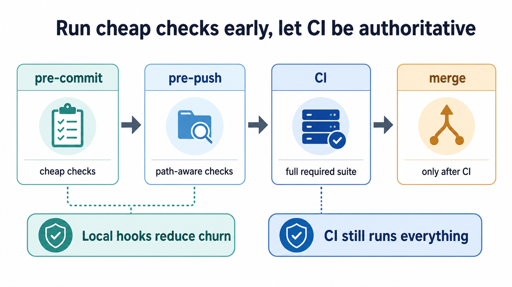
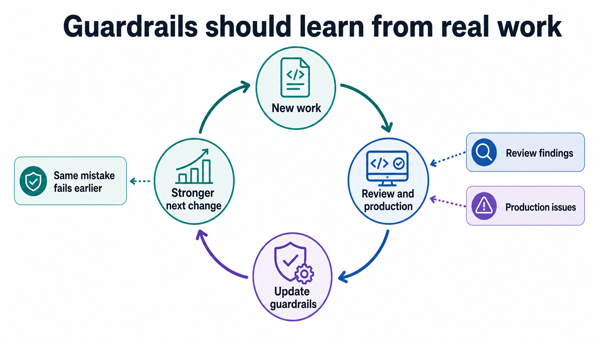
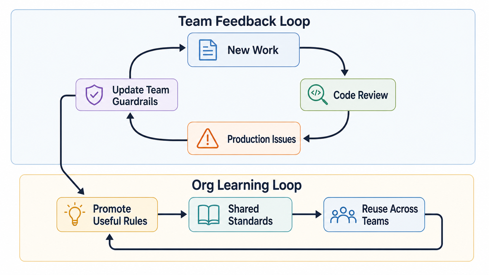

## Slop was already here

In the [previous article](/ai-slop-what-about-human-slop/), I argued that sloppy code is not new. Humans were already quite talented at writing it, and we are even more creative when explaining it away.

It may sometimes feel like LLMs are not good enough at coding yet, but they are also trained on the code we wrote, including all our bad habits. They will get better over time, but that is not the thing to wait for.

The better question is:

> **How do we reuse the mechanisms we already have to stop sloppy code from entering the repository?**

For a long time, strong engineering teams have used guardrails to promote good practices, catch regressions, and create a feedback loop for delivering better software. As they say, *do not throw the baby out with the bathwater*. We should reuse and retrofit the mechanisms that already work instead of pretending AI-assisted development needs a brand-new quality model with a shiny AI sticker on top.

By guardrails, I mean the checks and constraints that sit in the normal path of development and make bad changes harder to land: hooks, tests, linters, architecture checks, CI gates, review rules, and runtime policies. In AI product documentation, you will often see the same word used for checks around model inputs, outputs, and tool calls, as in the [OpenAI Agents SDK guardrails](https://openai.github.io/openai-agents-python/guardrails/) or [Amazon Bedrock Guardrails](https://docs.aws.amazon.com/bedrock/latest/userguide/guardrails.html). I am using the word a little more broadly here: **anything that makes the repo push back before a bad habit turns into committed code.**

## Junior engineer vs LLM agent

Junior engineers often start with messy first changes, which is normal, and at Google it is almost a rite of passage for Nooglers to receive a pile of comments on their first CL, sometimes fifty of them.

The point is not that junior engineers are bad. The point is that we are shaped by our environment. Review comments, tests, tooling, team standards, and repeated exposure to the codebase slowly mold our output for the better. A good engineer's output trends upward because the system around them keeps pushing them toward better habits.

With AI agents, the contrast is strange because each interaction can feel like talking to a maverick junior engineer who woke up with amnesia: the agent has a lot of built-in knowledge about frameworks, languages, and sometimes best practices, but it does not reliably remember the team context unless we provide it through prompts, `AGENTS.md`, skill files, and other long-term memory strategies.

As I mentioned in the previous post, these are suggestions, not mandates, and agents are unfortunately very good at treating suggestions like polite background music. What the agent really needs is guardrails that apply backpressure before the work reaches human reviewers.

Google's Tricorder is a useful example of this idea because the public paper, [Tricorder: Building a Program Analysis Ecosystem](https://static.googleusercontent.com/media/research.google.com/en//pubs/archive/43322.pdf), describes a program-analysis platform integrated into Google's developer workflow, where the important part is not the specific internal tool but the fact that analysis results show up where engineers already review code, creating a feedback loop between analyzer authors and developers. The [Software Engineering at Google](https://abseil.io/resources/swe-book/html/ch20.html) book also describes Tricorder as integrated with Google's code review tool, Critique.

That is the kind of guardrail I mean: not some **please read this and follow instructions** note on a Jira page, but instant feedback inside the path to submit code.

## Two separate jobs

At a high level, slop creates two separate jobs:

1. how to prevent new slop from entering the codebase
2. how to clean up the slop that is already there

**This post is about the first one: preventing new slop from entering the codebase.** The second one deserves its own post and will get one soon. For now, the question is narrower: how do we stop bad generated code before it lands?

## Shift Left

No, this is not about some woke agenda. It simply means you can either ask developers to catch everything manually during code review, which is a wonderful plan if your goal is to slowly drain everyone's soul, or you can automate the checks that are automatable and reserve human attention for the things that still require judgment.

We are flawed, we get tired, we undoubtedly miss things, and when the same low-value issue appears for the tenth time, we also get bored enough that the smart strategy is to make easy-to-describe mistakes fail before review.

**Ray Myers** says it well in the OpenHands webinar on [AI code quality and maintainability](https://www.youtube.com/watch?v=y60vYnBAvBI&t=2820s): the useful shift is moving feedback earlier. Guardrails are one of the best ways to do it. The pushback can come from instructions, hooks, tests, architecture checks, CI, or runtime policy. Sooner is better.

## Where should we run the guardrails?

The rule is simple: catch cheap mistakes locally, then run the full gate in CI, because nobody needs a remote build to discover that an import is unused or a formatter is angry.

If you are using git, then git hooks are the first line of defense. Pre-commit hooks should catch the obvious things while the change is still tiny: formatting, lint, protected files, generated-file churn, and other mistakes that should not need a remote build.

Pre-push hooks can be slightly heavier, and this is where path-aware checks help: if the agent touched backend code, run backend tests and architecture checks; if it touched frontend code, run lint, type checking, and formatting; if it touched hook scripts, validate the hooks themselves; and so on.

However, CI should be your authoritative line of defense. **Local hooks** exist to reduce CI churn and avoid distracting reviewers with code that is not ready for review, but they **do not replace CI**, because "it passed on my machine" is not a deployment strategy.

### Recommended shape

This is the shape I would recommend:

1. pre-commit catches cheap mistakes before the change grows
2. pre-push catches path-relevant failures before the branch leaves the machine
3. CI runs the full required check suite
4. merge happens only after the authoritative CI gate passes

## Humans still own the feedback loop

Let me be very clear about this: **guardrails will not magically fix all slop.**

They are not a replacement for human judgment or a substitute for human code review, because guardrails catch the things we already know how to describe and automate, while humans still have to catch the things that are not yet encoded:

1. a design that technically passes but feels wrong. This is where most of our attention should go
2. a change that follows the local pattern but violates product intent
3. a shortcut that is acceptable once but dangerous as a pattern. **LLMs are unfortunately quite notorious for taking shortcuts.** You have to watch for this. The shortcut may look acceptable once, but it becomes dangerous when the same pattern gets copied across the codebase.
4. an issue that escaped code review and only showed up in production

This is why our judgment becomes more important in this AI-enabled world. The goal is not for humans to exit the loop, but to move up the loop: from catching every mistake manually to improving the system that catches whole classes of mistakes. **Teams should review the misses, extract the pattern, and turn the pattern into a guardrail.**

## Why you should make the guardrails stricter than usual

In human-only teams, you have to be careful with friction because developers have opinions, deadlines, habits, and an excellent ability to complain in chat, and if the local development loop becomes painful, people will find ways around it.

LLM agents change that tradeoff because they do not have to pick up their kids early, plan a vacation, or rush to another meeting; they can sit with a failing check, read the error, and try again, which means we can make some guardrails stricter than we would normally make them for humans.

This reminds me of an incident that happened at my workplace a decade ago.

### Story time: The pushback from disgruntled engineers

The project was a Java API stack, and we had a fairly serious test setup: unit tests, branch coverage, and the usual enterprise gym equipment.

One of the principal engineers introduced [FindBugs](https://findbugs.sourceforge.net/) into the project. For people who have not lived through that era, FindBugs was a popular static-analysis tool for Java projects. It analyzed Java bytecode and looked for known bug patterns such as suspicious null handling, bad equality checks, concurrency mistakes, and other defects listed in its [bug pattern catalog](https://findbugs.sourceforge.net/bugDescriptions.html).[^findbugs]

It found a couple of good issues, and none of the developers complained because we welcomed the findings and incorporated the suggested fixes.

Then one day, the screws tightened a bit more.

The same checks started running against unit tests. Local development became slower. People complained in chat:

> Why are we running this here?  
> Why is my local loop slower now?  
> Is this rule even worth it?

Eventually, the team won, and the FindBugs checks against tests were disabled. I pride myself on being lazy as a developer, and unwanted friction is quite annoying; the noble engineering phrase for this is probably something like "developer productivity", but let us call the thing what it is. For us, strictness has to be balanced against other factors: deadlines, the effort required to address findings, and whether the findings are useful enough to justify the cost.

That balance looks different with agents. The agent does not need to be persuaded that the rule is good. If a guardrail fails with a clear message and explanation, the agent can correct its work before proceeding. The backpressure does its job: code has to satisfy the standards the team encoded before it asks for human attention.

So yes, make the guardrails tighter, but make them explain themselves instead of behaving like a mysterious enterprise tool that says "policy violation" and then goes for lunch.

I would also recommend reading [AI is forcing us to write good code](https://bits.logic.inc/p/ai-is-forcing-us-to-write-good-code), and while I agree with many of the approaches in that article, I would soften the idea that guardrails must be extremely fast from day one because agents have patience, they can wait, and although performance still matters, I would not optimize for speed first and waste too much effort there. Also, 100% code coverage feels excessive to me, but do what works for you.

## Why guardrails must keep evolving

The most important thing about guardrails is that they are not static. **They have to evolve based on what the team keeps seeing in real work.** You start with an initial set of rules, either from the organization's standards or from another project repo that your team already works on. Then, as you review changes from an agent or a teammate, you have to consciously identify bad patterns that keep repeating and turn them into updated guardrails.

**For example**, in one of the projects I was working on, we were using [Alembic](https://alembic.sqlalchemy.org/) to manage database migrations. Alembic is a database migration tool commonly used with [SQLAlchemy](https://www.sqlalchemy.org/); it lets a project describe schema changes as versioned migration scripts, so databases can move from one known structure to the next in a controlled way.

The agent's mistake was very specific:

> **It went back and edited an old migration script to fix the current table definition.**

That may look like a small cleanup if you treat migrations as ordinary code files, but old migrations are part of the historical path used to build or upgrade databases, and changing them casually can break environments that depend on that history. During review, when I pointed this out, the agent acknowledged its mistake and reverted the change.

The guardrail we needed was not complicated: old migrations should be treated as protected history, and any schema correction should happen through a new migration unless a human explicitly approves the exception.

The important part is that the lesson does not disappear after the review is closed, because otherwise the same mistake will come back wearing a slightly different shirt in the next diff. You have to watch for these patterns and tighten the guardrails when they repeat, and the diagram below is the center of the article: every review finding and production issue should either become a stronger check, a clearer instruction, or at least a sharper review habit.

Within a team, the loop is straightforward:

1. new work goes through review and production
2. review findings expose patterns the team keeps correcting manually
3. production issues expose mistakes that escaped the front door
4. the team updates guardrails
5. the next piece of work starts with stronger checks

Those updates can become project checks, agent instructions, hook rules, CI policy, or runtime admission checks.

**Then comes the part that is easy to forget: useful guardrails should not stay trapped inside one team.**

## Team learning should become org learning

Every team discovers some failure mode the hard way, and while each failure usually begins as a local annoyance inside one repo, one service, or one review thread, the lesson should not remain local if the underlying mistake is general. **If the lesson is general, it should move up.** This does not mean every project should inherit the exact same rule blindly, because a frontend app, a Python service, and a Kotlin backend will not share the same implementation details, but they can still share the same principle, the same failure pattern, and the same expectation that the codebase should push back before the mistake becomes normal.

The organization should have a path for this:

1. team discovers a repeated failure
2. team turns it into a local guardrail
3. team proves the guardrail catches real issues without too much noise
4. useful rule is promoted into shared standards
5. other teams adopt the rule in their own stack
6. new projects start with the stronger default

**This is how guardrails compound.**

Instead of ten teams learning the same lesson ten times, one team's review pain becomes everyone else's default protection, and the organization slowly builds a memory that is stronger than any one reviewer, any one prompt, or any one checklist sitting in a document that nobody reads after onboarding.

## Conclusion

That is the real point of guardrails: they are not merely a way to reject one bad commit, but a way to turn code review pain, production incidents, repeated shortcuts, and all the little moments where someone says "please do not do this again" into a system that remembers, instead of making the next reviewer perform the same little ritual of disappointment.

So start locally, make the repo push back, keep tightening the checks as humans and agents reveal new failure modes, and then make sure the useful lessons travel upward so the next team does not have to rediscover them the hard way.

**Do not ask humans or agents to be careful forever; make the system remember what careful means.**

In a future post, I will get more concrete and talk about the categories of guardrails teams can use in real codebases, along with the framework I would recommend for introducing them without turning the development loop into punishment.

Happy coding!

[^findbugs]: There is also a nice Google paper, [Experiences Using Static Analysis to Find Bugs](https://research.google.com/pubs/archive/34339.pdf), about using FindBugs in production settings. The broader point is the same as Tricorder: static analysis becomes most useful when it is wired into the normal engineering loop instead of being treated as an occasional cleanup ritual. FindBugs itself is old now; [SpotBugs](https://spotbugs.github.io/) is the maintained successor.

---

## References

- [AI slop? What about human slop?](/ai-slop-what-about-human-slop/)
- [OpenHands webinar: AI code quality and maintainability](https://www.youtube.com/watch?v=y60vYnBAvBI&t=2820s)
- [OpenAI Agents SDK guardrails](https://openai.github.io/openai-agents-python/guardrails/)
- [Amazon Bedrock Guardrails](https://docs.aws.amazon.com/bedrock/latest/userguide/guardrails.html)
- [Tricorder: Building a Program Analysis Ecosystem](https://static.googleusercontent.com/media/research.google.com/en//pubs/archive/43322.pdf)
- [Software Engineering at Google: Static Analysis](https://abseil.io/resources/swe-book/html/ch20.html)
- [FindBugs](https://findbugs.sourceforge.net/)
- [FindBugs Bug Descriptions](https://findbugs.sourceforge.net/bugDescriptions.html)
- [Experiences Using Static Analysis to Find Bugs](https://research.google.com/pubs/archive/34339.pdf)
- [SpotBugs](https://spotbugs.github.io/)
